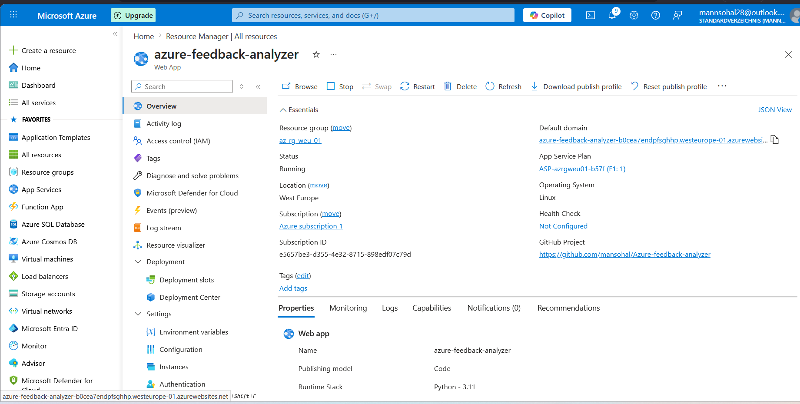
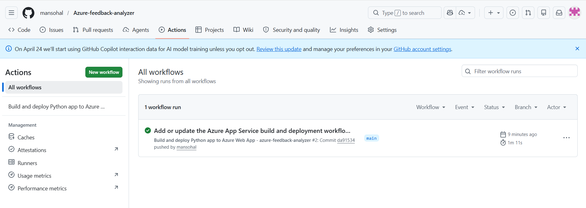
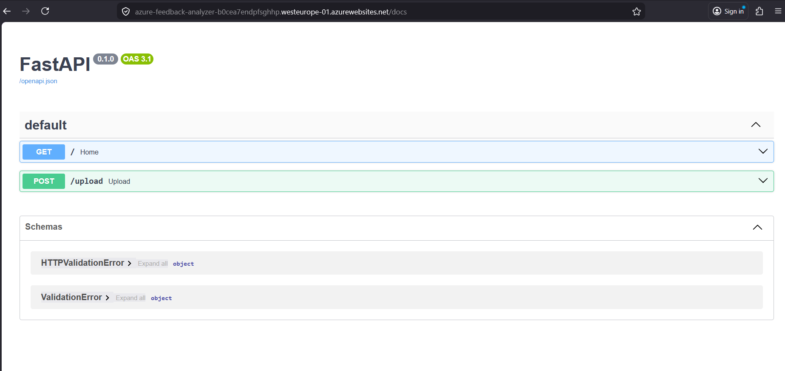

# Project: FastAPI Azure Foundation
> **Status:** Infrastructure & Deployment Phase Complete 

## Objective
The primary goal of this project was to establish a **production-ready cloud environment** for a Python API. 

## Technical Stack
* **Backend:** FastAPI (Python 3.11)
* **Cloud:** Microsoft Azure (App Service)
* **CI/CD:** GitHub Actions
* **Build Engine:** Azure Oryx

---

## Deployment Architecture
The workflow is fully automated:
1. **Code Push:** Developers push code to the `main` branch.
2. **GitHub Actions:** Triggers a build job to validate dependencies.
3. **Azure Deployment:** Securely pushed to **Azure West Europe**.

## Current Implementation
1. **API routing and health endpoints.**
2. **Automated Documentation (Swagger UI/ReDoc).**
3. **Environment variable configuration for future API keys.**
4 .**Upcoming: Sentiment Analysis logic and NLP integration.**

## Deployment Proof
Below is the confirmation of the live service and the successful CI/CD pipeline.

### Azure Portal Status

  

### GitHub Actions Pipeline

  

### Web URL Azure app running

  

